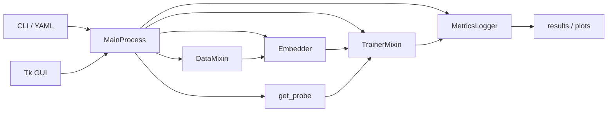

# Protify Documentation Hub

Protify is a low-code platform for training and evaluating protein (and chemical) language models on property-prediction and benchmarking tasks. You can run it via CLI, YAML config, or a Tk GUI, with optional cloud compute (Modal) and precomputed embeddings. This hub is the entry point for all Protify documentation.

For the full project story, installation options, and high-level usage, see the main [README](../README.md) in the repository root.

---

## Quick start

1. **Install:** `pip install -e .` from the repo root (or use the [Docker](getting_started.md#docker) image).
2. **Minimal CLI run** (one model, one dataset, probe-only):

   ```bash
   py -m src.protify.main --model_names ESM2-8 --data_names DeepLoc-2 --num_epochs 2
   ```

3. **YAML run:** Edit [src/protify/yamls/base.yaml](../src/protify/yamls/base.yaml) and run:

   ```bash
   py -m src.protify.main --yaml_path src/protify/yamls/base.yaml
   ```

Results and logs go to `results/` and `logs/` by default. For full install options and where outputs go, see [Getting started](getting_started.md).

---

## Documentation map

| Section | Description | Link |
|--------|-------------|------|
| **Getting started** | Installation (pip, venv, Docker), entry points, first CLI and YAML runs, output locations | [getting_started.md](getting_started.md) |
| **Configuration** | All CLI argument groups, YAML config (base.yaml), merge behavior, model_names vs model_paths, full examples | [cli_and_config.md](cli_and_config.md) |
| **Data** | DataArguments, supported datasets, data_dirs, loading flow, column normalization, translation flags, dataset classes | [data.md](data.md) |
| **Models and embeddings** | Base models (model_names / model_paths), get_base_model and get_tokenizer, EmbeddingArguments, Embedder flow, pooling, SQL vs PTH | [models_and_embeddings.md](models_and_embeddings.md) |
| **Probes and training** | Probe types (linear, transformer, interpnet, lyra), ProbeArguments, TrainerArguments, training flows (probe-only, full finetuning, hybrid, scikit), num_runs, save/export | [probes_and_training.md](probes_and_training.md) |
| **Model components** | For developers: attention, attention_utils, transformer, mlp; which probes use which | [model_components.md](model_components.md) |
| **ProteinGym** | ProteinGymRunner, scoring methods, run_proteingym_zero_shot, CLI args, compare_scoring_methods, benchmark | [proteingym.md](proteingym.md) |
| **Visualization** | create_plots (TSV format, six PNGs), regression vs classification metrics, ci_plots, CLI | [visualization.md](visualization.md) |
| **Logging and replay** | MetricsLogger, results TSV shape, log_metrics, LogReplayer, replay flow | [logging_and_replay.md](logging_and_replay.md) |
| **Hyperparameter optimization** | W&B sweep, sweep.yaml, HyperoptModule, CLI args, best-config rerun | [hyperparameter_optimization.md](hyperparameter_optimization.md) |
| **Modal** | Tk GUI Modal tab and modal_backend vs legacy Gradio app, config and path rewriting, deploy and run | [modal.md](modal.md) |
| **GUI** | Tk GUI tabs, settings and full_args, flow (session, data, embeddings, trainer), background tasks | [gui.md](gui.md) |
| **Resources** | Listing supported models and datasets (CLI and programmatic) | [resource_listing.md](resource_listing.md) |
| **Testing** | testing_suite layout, how to run pytest, Docker note | [testing.md](testing.md) |

---

## Architecture overview



- **Entry points:** [main.py](getting_started.md#entry-points) (CLI/YAML) and [gui.py](gui.md) (Tk). Both use the same `MainProcess` class.
- **MainProcess** composes: [DataMixin](data.md) (data loading), [Embedder](models_and_embeddings.md) (embeddings), [get_probe](probes_and_training.md) (probe construction), [TrainerMixin](probes_and_training.md) (training loop), and [MetricsLogger](logging_and_replay.md) (session log and results TSV).
- Config is a single namespace from argparse plus optional YAML merge; see [Configuration](cli_and_config.md).

---

## See also

- [Getting started](getting_started.md) for install and first runs
- [Configuration](cli_and_config.md) for all arguments and YAML
- [resource_listing.md](resource_listing.md) for listing models and datasets
