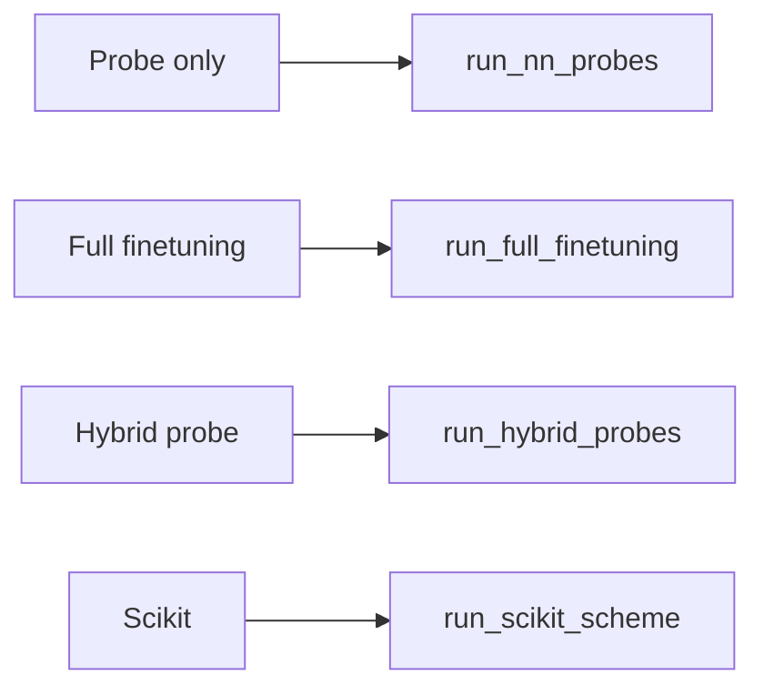

# Probes and Training

This page documents probe types (linear, transformer, lyra), `ProbeArguments` and `get_probe`, `TrainerArguments` and `TrainerMixin`, and the training flows: probe-only (`run_nn_probes`), full finetuning, hybrid, and scikit. It also covers `num_runs` aggregation and model save/export.

---

## Overview

A **probe** is a trainable head on top of (frozen or trainable) base model embeddings. Protify supports three probe types: **linear** (MLP), **transformer**, and **lyra**. Training can be probe-only (default), full base-model finetuning, or hybrid (train probe then finetune base+probe). The scikit path uses precomputed embeddings with sklearn-style models. All probes share a common forward API (embeddings, attention_mask, optional labels) and return loss, logits, and optional hidden_states/attentions.

---

## How it works

1. **ProbeArguments** is built from config; `get_probe(probe_args)` returns the appropriate probe (sequence or token classification).
2. **TrainerMixin** uses `get_probe()`, builds datasets and collators from embeddings (or raw sequences for full/hybrid), and runs the HuggingFace `Trainer` with early stopping and optional multi-run aggregation.
3. **MainProcess** branches: `run_nn_probes()` (default), `run_full_finetuning()`, `run_hybrid_probes()`, or `run_scikit_scheme()` (or W&B hyperopt). Each iterates over models and datasets and calls the appropriate trainer method.



---

## Probe types

| Type | Sequence | Token | Description |
|------|----------|-------|-------------|
| **linear** | Yes | No | MLP on pooled embeddings. Fastest; good baseline. |
| **transformer** | Yes | Yes | Transformer stack + pooler/classifier. Uses [model_components](model_components.md) Transformer. |
| **lyra** | Yes | Yes | S4/Lyra probe; no shared model_components. |

**When to use:** Linear for speed and baselines; transformer for better accuracy when compute allows; lyra for sequence modeling alternatives. Token-wise is for residue-level tasks (e.g. secondary structure).

---

## ProbeArguments

Defined in [get_probe.py](https://github.com/gleghorn-lab/Protify/blob/main/src/protify/probes/get_probe.py). Key attributes (CLI names in parentheses where different):

| Argument | Type | Default | Description |
|----------|------|---------|-------------|
| `probe_type` | str | linear | linear, transformer, lyra. |
| `tokenwise` | bool | False | Token-wise prediction. |
| `input_size` | int | 960 | Input dimension (set from embedding size). |
| `hidden_size` | int | 8192 | Hidden size for linear probe MLP. |
| `transformer_hidden_size` | int | 512 | Hidden size for transformer. |
| `dropout` | float | 0.2 | Dropout. |
| `num_labels` | int | 2 | Number of classes (set from data). |
| `n_layers` | int | 1 | Number of layers. |
| `task_type` | str | singlelabel | singlelabel, multilabel, regression, etc. |
| `pre_ln` | bool | True | Pre-LayerNorm. |
| `sim_type` | str | dot | dot, cosine, euclidean. |
| `use_bias` | bool | False | Bias in Linear layers. |
| `add_token_ids` | bool | False | Token type embeddings for PPI. |
| `classifier_size` | int | 4096 | Classifier FF dimension. |
| `transformer_dropout` | float | 0.1 | Transformer dropout. |
| `classifier_dropout` | float | 0.2 | Classifier dropout. |
| `n_heads` | int | 4 | Attention heads. |
| `rotary` | bool | True | Rotary embeddings. |
| `attention_backend` | str | flex | kernels, flex, sdpa. |
| `output_s_max` | bool | False | Return s_max from attention. |
| `probe_pooling_types` | List[str] | ['mean', 'cls'] | Pooling types (stored as `pooling_types`). |
| `lora` | bool | False | Use LoRA on base model (hybrid/full). |
| `lora_r`, `lora_alpha`, `lora_dropout` | int, float, float | 8, 32.0, 0.01 | LoRA hyperparameters. |

---

## get_probe and rebuild_probe_from_saved_config

- **get_probe(args: ProbeArguments)**
  Returns a probe instance: `LinearProbe`, `TransformerForSequenceClassification`, `TransformerForTokenClassification`, or the Lyra variants. Config is built from `args.__dict__` (with `hidden_size` overridden by `transformer_hidden_size` for transformer).

- **rebuild_probe_from_saved_config(probe_type, tokenwise, probe_config)**
  Rebuilds the same probe classes from a saved config dict (e.g. when loading a packaged model).

---

## TrainerArguments

Defined in [trainers.py](https://github.com/gleghorn-lab/Protify/blob/main/src/protify/probes/trainers.py).

| Argument | Type | Default | Description |
|----------|------|---------|-------------|
| `model_save_dir` | str | (required) | Output directory for training and HF save. |
| `num_epochs` | int | 200 | Epochs. |
| `probe_batch_size` | int | 64 | Batch size (probe). |
| `base_batch_size` | int | 4 | Batch size (base model). |
| `probe_grad_accum` | int | 1 | Gradient accumulation (probe). |
| `base_grad_accum` | int | 1 | Gradient accumulation (base). |
| `lr` | float | 1e-4 | Learning rate. |
| `weight_decay` | float | 0.00 | Weight decay. |
| `task_type` | str | regression | regression or classification. |
| `patience` | int | 3 | Early-stopping patience. |
| `read_scaler` | int | 100 | For dataset read scaling (e.g. SQL). |
| `save_model` | bool | False | Save/push model (e.g. to Hub). |
| `push_raw_probe` | bool | False | With save_model, push raw probe class to Hub (load with Class.from_pretrained(repo_id)) instead of packaged AutoModel. |
| `seed` | int | 42 | Random seed. |
| `plots_dir` | str | None | Directory for CI plots. |
| `full_finetuning` | bool | False | Full finetuning mode. |
| `hybrid_probe` | bool | False | Hybrid mode. |
| `num_workers` | int | 0 | DataLoader workers. |
| `make_plots` | bool | True | Generate CI plots. |
| `num_runs` | int | 1 | Number of seeds; aggregate mean and std. |

Calling `trainer_args(probe=True)` or `trainer_args(probe=False)` returns HuggingFace `TrainingArguments` with the appropriate batch size and grad accumulation.

---

## Training flows

- **run_nn_probes():** For each (model, dataset), load embeddings from disk (or use in-memory dict), build probe with `get_probe(probe_args)`, run `trainer_probe()`. Single run or `num_runs` with aggregation (mean and std, best run by test loss).
- **run_full_finetuning():** Uses raw sequences; builds base model for training (no probe head for sequence-level; base outputs go to loss). Same single/multi-run pattern via `trainer_base_model()`.
- **run_hybrid_probes():** For each run: (1) train probe only (`trainer_probe`, skip_plot=True), (2) wrap base + trained probe in `HybridProbe`, (3) run `trainer_base_model(hybrid_model, ...)`. Aggregates metrics; optionally plots best run.
- **run_scikit_scheme():** Uses `prepare_scikit_dataset` and sklearn/lazy-predict; no probe training.

---

## num_runs aggregation

When `num_runs > 1`, the trainer runs training `num_runs` times with different seeds, collects metrics (e.g. test loss, spearman), and computes mean and std. The best run (by test loss or selected metric) is used for optional CI plots and reporting. Metrics logged include `*_mean` and `*_std` variants.

---

## save_model and export

When `save_model` is True, after training the code can export to the HuggingFace Hub in two ways:

- **Default (packaged):** Export a packaged model (backbone + probe) via `export_packaged_model_to_hub(...)`. The repo is loadable with `AutoModel.from_pretrained(repo_id)`. If packaged export is not supported or fails, it falls back to pushing the full model (hybrid or probe) and a README.
- **Raw probe (`--push_raw_probe`):** Skip packaged export and push only the raw probe class plus a README. Load with the probe class directly. For hybrid runs, only the probe submodule is pushed, not the full hybrid.

Production export uses the same probe rebuild API so that the packaged artifact can be loaded elsewhere.

---

## Examples

### Linear probe (default)

```bash
py -m src.protify.main --model_names ESM2-8 --data_names DeepLoc-2 --probe_type linear
```

### Transformer probe with more layers

```bash
py -m src.protify.main --model_names ESM2-35 --data_names DeepLoc-2 --probe_type transformer --n_layers 2 --transformer_hidden_size 256
```

### Multiple runs with aggregation

```bash
py -m src.protify.main --model_names ESM2-8 --data_names DeepLoc-2 --num_runs 3
```

### Full finetuning

```bash
py -m src.protify.main --model_names ESM2-8 --data_names DeepLoc-2 --full_finetuning --num_epochs 10
```

### Hybrid probe

```bash
py -m src.protify.main --model_names ESM2-8 --data_names DeepLoc-2 --hybrid_probe
```

### Scikit path

```bash
py -m src.protify.main --model_names ESM2-8 --data_names DeepLoc-2 --use_scikit
```

---

## See also

- [Configuration](cli_and_config.md) for probe and trainer CLI flags
- [Model components](model_components.md) for attention and transformer used by probes
- [Models and embeddings](models_and_embeddings.md) for how embeddings are produced
- [Data](data.md) for dataset building
- [Hyperparameter optimization](hyperparameter_optimization.md) for W&B sweep
